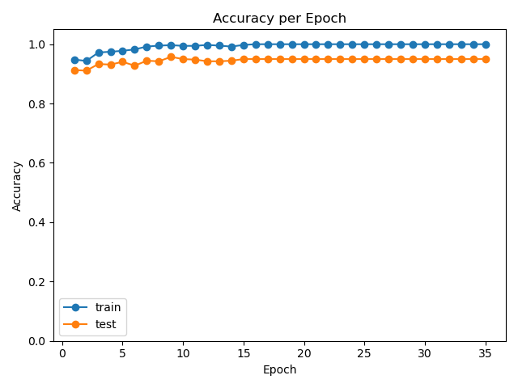
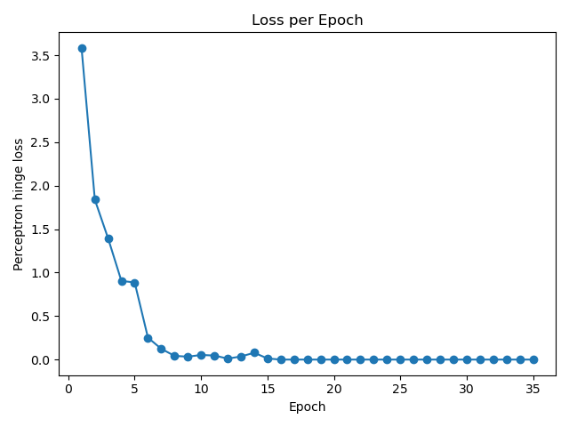
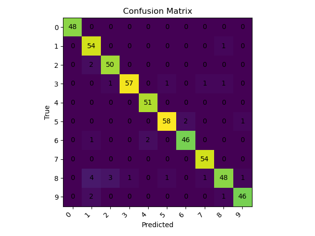

# Multiclass Perceptron from Scratch

**Multiclass perceptron classifier** implemented using **pure NumPy**—no scikit‑learn or deep‑learning frameworks.  
This project trains a perceptron on the handwritten digits dataset (`0–9`) and generates:

- 📈 **Accuracy curves** (train & test)
- 📉 **Loss curves** using the multiclass hinge loss
- 🔢 **Confusion matrix**
- 🧪 **Live per‑epoch logs** during training

The repository is designed for learning and teaching how perceptrons work internally.

---

## 1. Project Overview

This implementation demonstrates how to build a full **multiclass linear classifier** from first principles.  
It shows:

- How a perceptron updates its weights during training
- Real learning curves on real data
- Clear and interpretable visualizations
- A dependency‑free approach—only NumPy is required for the model

---

## 2. Repository Structure

The core files are organized as follows:

```
├── main.py              # Entry point: training, logging, evaluation
├── model.py             # Multiclass perceptron
├── utils.py             # Preprocessing, plotting, confusion matrix
├── outputs/             # Generated plots and confusion matrix
│   ├── accuracy_per_epoch.png
│   ├── loss_per_epoch.png
│   └── confusion_matrix.png
└── README.md
```

---

## 3. Theory

### 3.1 Model

The perceptron learns **one weight vector per class**.  
With ten digit classes, the weights matrix is:

$$
W =
\begin{bmatrix}
 w_0 \\
 w_1 \\
 \vdots \\
 w_9
\end{bmatrix},\quad
w_k \in \mathbb{R}^{65}
$$

Each weight vector $w_k$ has 64 pixel features plus a bias term, hence the dimension of 65.

### 3.2 Forward Pass (Prediction)

1. **Augment the input** with a bias term: $\tilde{x} = [x_1, x_2, \dots, x_{64}, 1]$.

2. **Compute class scores** by taking the dot product with each weight vector: $s_k = w_k^\top \tilde{x}$.

3. **Predict the class** with the highest score: $\hat{y} = \arg\max_k s_k$.

### 3.3 Learning Rule (Perceptron Update)

When the model predicts incorrectly:

- **Increase** the weights of the true class: $w_y \leftarrow w_y + \eta\,\tilde{x}$.

- **Decrease** the weights of the wrongly predicted class: $w_{\hat{y}} \leftarrow w_{\hat{y}} - \eta\,\tilde{x}$.

This update pushes the decision boundary toward the correct classification.

### 3.4 Loss Function (Multiclass Hinge Loss)

For monitoring training progress, the multiclass hinge loss is used:

$$
\text{loss} = \max\bigl(0,\; 1 + s_{\text{wrong}} - s_{\text{true}}\bigr).
$$

The loss approaches zero as the model becomes more confident in its predictions.

---

## 4. Dataset — `load_digits`

We use the `load_digits` dataset from `sklearn.datasets`.  
It contains:

- **1797** grayscale images of size \(8 \times 8\) (i.e. 64 features)
- Labels for digits **0–9**

This dataset is small, fast to train on, and sufficiently separable; a perceptron typically achieves around **97–99 %** test accuracy.

---

## 5. Installation & Usage

### 5.1 Install dependencies

To run the training script you'll need NumPy, Matplotlib, and scikit‑learn (for the dataset only).  
Install them via pip:

```bash
pip install numpy matplotlib scikit-learn
```

### 5.2 Run training

Execute the main training script:

```bash
python main.py --epochs 40 --lr 1.0 --seed 0
```

All outputs—including training logs and generated plots—are saved in the `outputs/` directory.

---

## 6. Results & Visualizations

### 6.1 Accuracy per Epoch



**Interpretation**:

- Training accuracy rises quickly.
- Test accuracy stabilizes around **97–99 %**.
- A small gap between train and test curves indicates good generalization.

### 6.2 Loss per Epoch



**Interpretation**:

- High loss early indicates many mistakes.
- The loss drops rapidly as the model learns.
- The loss approaches zero as the perceptron becomes confident.

### 6.3 Confusion Matrix



**Interpretation**:

- **Rows** represent true classes.
- **Columns** represent predicted classes.
- The diagonal cells show correct predictions.
- Off‑diagonal cells indicate confusions (e.g. digits 8 and 3 may sometimes be misclassified for each other).

---

## 7. File Descriptions

### `model.py`

Implements the multiclass perceptron:

- Forward pass
- Weight update (perceptron learning rule)
- Multiclass hinge loss
- Scoring and prediction functions

### `utils.py`

Provides helper functions for:

- Train/test splitting (NumPy‑only)
- Standardizing the data
- Plotting accuracy and loss curves
- Generating and plotting the confusion matrix

### `main.py`

Manages:

- Loading and preprocessing the dataset
- Training the perceptron
- Logging per‑epoch metrics
- Saving plots to the `outputs/` directory

---

## 8. Summary

This project delivers:

- A fully functional multiclass perceptron with a clear mathematical foundation
- Real training curves and evaluation metrics
- A concise, dependency‑free NumPy implementation

---